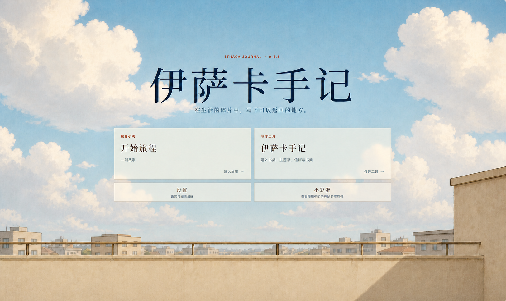

# 伊萨卡手记 | The Ithaca Journal



> `0.4.1` 开发版：左侧进入视觉小说，右侧进入互动书写工具。

《伊萨卡手记》是一个将视觉小说与互动书写工具嵌合在同一作品中的 Research through Design 项目。当前开发重点是完成视觉小说的故事、演出与可运行版本。

## 1. 设计决策：用开发者元故事嵌合视觉小说与工具（DE-003）

项目最初形成了书桌、主题板、信箱和书架等开放式写作空间。上一阶段曾尝试把这些工具重新编排为围绕“自主性”与“共融性”的主题旅程，但实际制作逐渐变成了对概念和功能的解释，仍然没有回答“这是一部什么故事”。

当前的设计决策，是把“为什么有人会创造《伊萨卡手记》”本身变成视觉小说：

```text
玩家进入视觉小说
  → 认识正在求职的年轻开发者
    → 见证他重新打开并打磨《伊萨卡手记》
      → 在故事中看见或体验写作工具
        → 工具成为面试、评价与失败的一部分
          → 项目停在没有下一版的位置
```

视觉小说讲述一名刚毕业的年轻人来到陌生城市求职，并准备把此前开发的《伊萨卡手记》作为面试作品。日记、碎片、主题、书信和书籍等功能从他的经历与制作回忆中出现；A/B/C 只是面试前形成的阶段性版本；故事最终停在项目无疾而终的位置，不用重新理解 C、继续开发或获得成长补偿来收束。

因此，视觉小说不是工具外面增加的一层包装，工具也不是与故事无关的功能集合：开发者元故事解释工具为何出现、如何被赋予意义，又如何在现实压力中被搁置；工具则成为故事中可以操作、展示和质疑的具体作品。

首页仍保留两个独立入口：

| 入口 | 作用 |
| --- | --- |
| **视觉小说｜开始旅程** | 进入作者编排的开发者元故事。 |
| **写作工具｜伊萨卡手记** | 独立使用书桌、主题板、信箱和书架。 |

这是当前正在制作的设计方向，不是已经得到参与者使用证据支持的研究结论。

## 2. 在本地电脑运行本项目

这里的“迁移”是恢复一套可继续开发的本地环境：取得源码，安装锁定依赖，从迁移文件重建一个空的本地数据库，然后启动应用。它默认不搬运原电脑上的用户日记、账户数据、D1 本地状态或密钥。

### 2.1 获取源码并安装依赖

先安装 Git、Node.js 和 npm，然后执行：

```bash
git clone https://github.com/666feiyu666/Ithaca-Journal.git
cd Ithaca-Journal
git switch journey
npm ci
```

`npm ci` 会严格按照 `package-lock.json` 恢复项目依赖。Cloudflare Wrangler 已作为开发依赖包含在项目中，不需要全局安装。

### 2.2 创建这台电脑自己的本地密钥

复制环境变量示例：

```powershell
# Windows PowerShell
Copy-Item .dev.vars.example .dev.vars
```

```bash
# macOS / Linux
cp .dev.vars.example .dev.vars
```

生成一个新的 32 字节 Base64URL 值：

```bash
node -e "console.log(require('node:crypto').randomBytes(32).toString('base64url'))"
```

把命令输出填入 `.dev.vars`：

```dotenv
VAULT_KEY_ENCRYPTION_KEY=这里替换为刚才生成的值
```

为什么空数据库仍需要这个本地密钥：应用会为本地开发账户创建一个用于加密存档内容的账户密钥，再用 `VAULT_KEY_ENCRYPTION_KEY` 将它封装后保存到本地 D1。这个值不是云端凭据，也不是用户密码，只是这台开发机保护本地账户密钥所需的机器级密钥。缺少它时，应用可以加载静态页面，但账户存档服务无法创建或解封密钥，因而不能完整使用写作与存档功能。

如果只是在新电脑上重建空数据库，应当生成一个新值。只有在明确迁移旧电脑的本地用户数据时，才需要把旧 D1 数据和旧 `.dev.vars` 一起安全迁移；只复制其中一个，原有加密数据将无法读取。`.dev.vars` 已被 Git 忽略，不会随仓库上传。

### 2.3 重建本地数据库

```bash
npx wrangler d1 migrations apply DB --local
```

Wrangler 会从 `migrations/0001_initial.sql` 开始应用完整迁移链。这条命令只创建或更新本机的 D1 状态，不连接 staging 或 production。

### 2.4 启动应用

```bash
npm run dev
```

启动前会先编译并校验 `narrative/journey/story.zh-CN.twee`，随后由 Wrangler 在终端输出本地访问地址。

### 2.5 验证恢复结果

```bash
npm run check
npm test
npm run test:integration
npm run build
```

恢复完成的最低判断是：依赖安装成功、完整迁移链能够应用到空数据库、应用可以本地启动，并且类型检查、单元测试、集成测试与 dry-run 构建全部通过。

通过 Git 恢复的是源码、迁移、生成脚本、测试、Journey 作者源和必要运行资源；不会恢复 `node_modules/`、`.dev.vars`、本地 D1、用户数据、日志、缓存、构建输出或仓库外的大型美术源文件。
