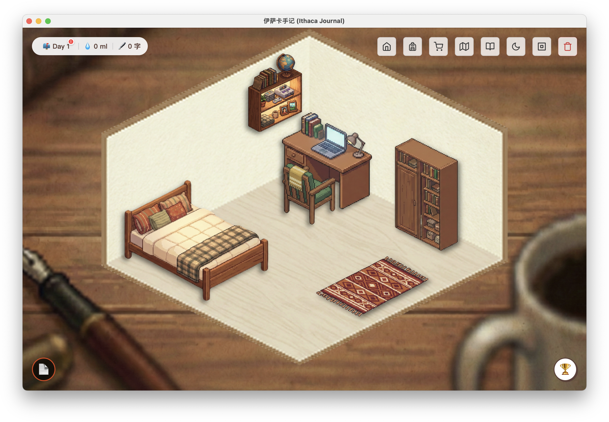

# 🍍 伊萨卡手记 | The Ithaca Journal
  

---

## 当前开发主线（2026-08）

项目正在从已冻结的 Electron 桌面原型转向小范围邀请测试的 Web 版本。新的 C0 纵切片位于 [`cloud/`](cloud/)，采用 **Cloudflare Workers Static Assets + Worker API + Access + D1**：远程测试由邮箱允许名单和一次性验证码进入，本地使用 localhost 开发身份；当前目标是完成受邀登录、手记持久化、重新打开、导出与删除的完整路径。

> C0 明确采用服务器可读的数据模型；正文不会进入应用日志，客户端加密将在后续隐私阶段重新评估。当前只部署了使用合成内容验证的 Cloudflare staging，production 尚未创建。

- [云端 C0 开发说明](cloud/README.md)
- [Cloudflare staging](https://ithaca-journal-cloud-staging.feiyut666.workers.dev)
- [论文对应的冻结 macOS Release](https://github.com/666feiyu666/Ithaca-Journal/releases/tag/paper-2026-beyond-psychological-reductionism)
- [ResearchGate 论文](https://www.researchgate.net/publication/412164002_Beyond_Psychological_Reductionism_A_Dramatistic_Critique_of_Gamification_and_the_Design_Practice_of_Ithaca_Journal)
- [Itch.io 冻结原型](https://frank-don.itch.io/ithaca-journal)

---

## 📖 已冻结桌面原型 (Paper Artifact)


**《伊萨卡手记》** 是一款融合了**叙事理论**与**游戏化机制**的桌面端日记应用。

我们试图回应一个古老而恒久的命题：**“我是谁？”**

> “知道我是谁，就是知道我站在何处。知道我是谁，就是知道我从哪里来，要到哪里去。”

在这个被碎片化信息裹挟的数字时代，我们常常迷失了那个存在的“坐标”。《伊萨卡手记》试图为你构建一个虚拟的“精神栖居地”。这不仅仅是一个支持 Markdown 的文本编辑器，更是一场为期 **21天** 的奥德赛——我们希望通过书写，帮助你**重构自我叙事**，在混乱的日常中重新确认自己的立足点，找到生活的节奏。

在这里，你不仅是探索世界、装饰房间的 **玩家**，也是记录生活、构建自我的 **作家**。

---

### 📥 下载体验 (Download)

如果你不想配置开发环境，可以直接下载打包好的应用版本进行体验：

👉 **[点击前往 Itch.io 下载](https://frank-don.itch.io/ithaca-journal)**

---

## ✨ 核心特性 

### 🎮 游戏：寻找失落的篇章

* **📖 残缺的《伊萨卡手记》**：
    * 游戏的名字并非巧合。在房间的书架上，你会找到一本名为 **《伊萨卡手记》** 的书。
    * **它为什么是残缺的？** 起初，这本书只有第一部分。随着游戏的进行，你会将这本残缺的书一点点补齐，还原出它原本的模样。
* **✉️ 神秘来信**：
    * 故事始于一封寄错的信。“糖水菠萝”为何不断给你写信？
    * Ta 的信中那些关于生活、关于叙事的探讨，似乎不仅是闲聊，更是与 **《伊萨卡手记》** 的内容直接挂钩。
* **📅 21天旅程**：
    * 这是一场设定好的短期旅行。每天登录，你都会解锁新的剧情碎片。
    * 坚持完成全部 **21天** 的旅程，当那本《伊萨卡手记》最终被补全的那一刻，你将在终点收获一个意想不到的**专属彩蛋**。
* **💧 墨水与装修**：
    * 你的每一次书写都会转化为“墨水”能量。
    * 使用墨水在商店购买家具，从零开始装扮这个空荡荡的房间，让它变成你理想中的样子。
* **🏆 成就系统**：
    * 记录你的每一个里程碑，无论是第一次写满1000字，还是成功出版属于你自己的第一部作品，都会被永久铭记。

### 🛠️ 工具：所见即所得的交互

* **🪑 交互式家具**：
    * 房间里的家具不仅仅是装饰，更是实用的功能入口。
* **📝 写作台 (创作与编纂)**：
    * **心流书写**：点击桌子进入无干扰的 Markdown 写作环境，专注于当下的思绪。
    * **主题归档**：你可以自由创建特定的**手记本**（如“日常碎片”、“写毕业论文”），将日记分门别类地归档。
    * **装订成书**：最独特的是**装订模式**。你可以像编辑一样，将某个主题下的零散日记重新挑选、排序、串联，最终汇集成一部完整的**个人故事**。
* **📚 书架 (珍藏与回顾)**：
    * 点击书架回顾往期作品。这里陈列着那本神秘的《伊萨卡手记》，也摆放着你亲手装订的每一部作品。
    * 所有书籍均支持**导出为 Markdown**，让你的记忆触手可及。
* **📫 信箱 (收件)**：
    * 点击左上角的信箱查收系统来信。这里是你与游戏世界沟通的桥梁。

### 🔮 未来：城市漫游与相遇

* **🏙️ 城市漫游 (2.0计划)**：
    * **视觉小说** 走出房间，去虚拟的城市街道散步。与不同的人物相遇，了解他们的故事。
* **🧩 叙事合成 (2.0计划)**：
    * **碎片收集**：留心收集散落在城市各处的神秘碎片。
    * **重组解谜**：将碎片重组，你可能会还原出前任房客尘封的故事，拼凑出这个世界背后的真相。

---

## 🚀 冻结桌面版本运行 (Frozen Desktop Development)

### 🛠️ 技术栈 (Tech Stack)

以下说明只适用于论文对应的 **Electron 冻结版本**；新的云端主线请使用 [`cloud/README.md`](cloud/README.md)。

* **Core**: Electron (Main/Renderer Process)
* **Frontend**: HTML5, CSS3 (Grid/Flexbox), Vanilla JavaScript (ES6+)
* **Data Persistence**: Node.js File System (fs) & LocalStorage
* **Markdown Engine**: `marked.js`

如果你是开发者，或者想自己在本地运行源代码，请按照以下步骤操作：

### 1. 环境准备
确保你的电脑上安装了 [Node.js](https://nodejs.org/) (建议 v16+)。

### 2. 获取代码
```bash
git clone [https://github.com/your-username/ithaca-journal.git](https://github.com/your-username/ithaca-journal.git)
cd ithaca-journal
```

### 3. 安装依赖
```bash
npm install
```

### 4. 启动伊萨卡
```bash
npm start
```

桌面版已经由 `paper-2026-beyond-psychological-reductionism` 标签冻结，不再在该技术路线继续功能开发。

---

## 📖 参考书目 (References)

《伊萨卡手记》的设计灵感起初源于荷马的《奥德赛》与西格尔对《奥德赛》的解读，之后也参阅了一些对叙事自我、伦理与现代性认同的书籍。
以下是我们主要的参考书目：

* **荷马** - 《奥德赛》
* **查尔斯·西格尔** - 《奥德赛中的歌手、英雄与诸神》
* **张容南** - 《叙事的自我：我们如何以叙事的方式理解自身》
* **宋薇** - 《麦金太尔伦理叙事研究》
* **安东尼·吉登斯** - 《现代性与自我认同：晚期现代中的自我与社会》
* **查尔斯·泰勒** - 《自我的根源：现代认同的形成》
* **阿拉斯戴尔·麦金太尔** - 《追寻美德》
* ……
